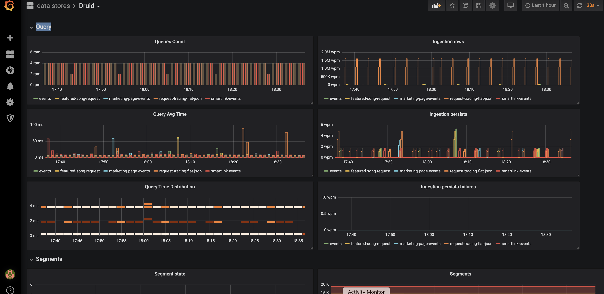

Forked from [https://github.com/helm/charts/tree/master/incubator/druid](https://github.com/helm/charts/tree/master/incubator/druid)

# Apache Druid Helm Chart

[Apache Druid](https://druid.apache.org/) is a high performance analytics data store for event-driven data.

#### Why not just use incubator/druid helm chart?

While the official chart is a great start (thanks to maver1ck, the maintainer) 
and we shamelessly copied many parts of it,
the official chart is not up to date with the newer version of druid,
and it does not support the apache-druid official docker image.

So we made some changes to match apache-druid 0.16+

### Install the Chart

Add the featurefm helm repo:

```
helm repo add featurefm 'https://raw.githubusercontent.com/listnplay/charts/master/'
```

Create a `my-values.yaml` and make your modifications. Use [my-values.yaml](my-values.yaml) as template.


**Note** The chart will not work properly without *deep storage* defined (e.g. in s3 bucket). 
See [my-values.yaml](my-values.yaml) file for s3 example.
See the [Docs](https://druid.apache.org/docs/latest/configuration/index.html#deep-storage) 
for details on the deep storage config options for GCP, Azure, etc.


To install the Druid Chart into your `bi` namespace of your Kubernetes cluster:

```bash
helm install --namespace "bi" --name "druid" featurefm/druid -f my-values.yaml
```

### Uninstall
If you want to delete your Chart, use this command:

```bash
helm delete  --purge "druid"
```

### Druid Services

This chart exposes the following Druid services as kubernetes services.
Most likely, you will only need the *router* for UI management, *turnilo* for data exploration, 
and the *broker* for client queries.

- druid-router - the new druid UI management console
- druid-broker - entry point for queries
- druid-coordinator (+Overlord)
- druid-historical 
- druid-middle-manager (+Peons) 


- druid-turnilo - [Allegro](https://github.com/allegro/turnilo)'s 
cool (and free) data exploration and visualization UI for druid.

### External Services

The chart install a Druid along with its supporting external services: 

- *zookeeper* for leader election and instance discovery
- *postgresql* as the metadata store

these dependencies can be customized in the values.yaml,
or can be disabled altogether if you choose to provide your own installations.


### Druid configuration

The intention of this chart is to make druid easy to install, 
yet keep the option to apply more advanced configuration where needed.

for example, the druid extension list can be stated as follow:

    extensions:
      loadList:
      - druid-histogram
      - druid-datasketches
      - druid-lookups-cached-global
      - postgresql-metadata-storage
      - druid-s3-extensions
      - druid-kafka-indexing-service

Any druid configuration can be supplied in the `env` section, 
 substitution of dot (.) for an underscore (_);
for example, here's the configuration for s3 bucket as deep storage:

    env:
      # Deep storage
      # specify your bucket name for s3 deep storage & indexer logs
      druid_storage_type: s3
      druid_storage_bucket: <my-druid-deep-storage-bucket>
      druid_storage_baseKey: druid/segments
      druid_indexer_logs_type: s3
      druid_indexer_logs_s3Bucket: <my-druid-deep-storage-bucket>
      druid_indexer_logs_s3Prefix: druid/indexing-logs

Also note that each Druid service can have its own `env` section 
to configure that service and possibly override the common `env` configuration.

### Monitoring

Prometheus monitoring can be enabled as follow:
        
    monitoring:
      enabled: true
      createServiceMonitor: true

and Druid will be configured to emmit metrics to a sidecaer that collects and exposes them to prometheus automatically.
You can use the [grafana dashboard](druid-grafana-dashboard.json) to view these metrics.



### Middle Manager and Historical Persistence Notes

_Middle Managers_ and _Historicals_ use a StatefulSet.
Persistence is enabled by default.

**Note** that while the stateful services can retrieve their copy of the data from the deep storge 
if restarted without persistence,
such recovery will take considerable time to complete.


### Other Chart Configuration

Full and up-to-date documentation can be found in the comments of the [values.yaml](values.yaml) file.
